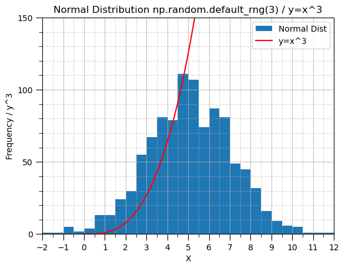

<h1> Assessments for Programming and Scripting 
</h1>
<p> 
Course: HDip in Computing in Data Analytics <br>
Module: Programming and Scripting <br>
Lecturer: Andrew Beatty
    
Student: Eilis Donohue (G00006088)

A repository for the solutions to the problem sheets given in the Programming and Scripting Module of the HDip in Data Analytics beginning January 2023. All programs except for es.py may be run in this Jupyter Notebook. The .ipynb notebook should be run locally (not on github). This page is frontpage facsimile of the .ipynb notebook.

Software Used: 
 - Python v3.7 and higher  
 - Jupyter Notebook 6.4.12 
</p>

 - - -

## Table of Contents: <a id="toc"></a> 
1. [Task 1 (helloworld.py)](#task1)
2. [Task 2 (bank.py)](#task2)
3. [Task 3 (accounts.py)](#task3)
4. [Task 4 (collatz.py)](#task4)
5. [Task 5 (weekday.py)](#task5)
5. [Task 6 (squareroot.py)](#task6)
5. [Task 7 (es.py)](#task7)
6. [Task 8 (plottask.py)](#task8)

 - - -

## Task 1 (helloworld.py) <a id="task1"></a> <span style="font-size: 3pt;">[TOC](#toc)</span>

Task Description:

<i> This file should contain a python program that displays Hello World! when it is run. </i>

Program Description:
 - Print statement to print **Hello World!**


```python
print("Hello World!")
```

    Hello World!
    

- - - 

## Task 2 (bank.py) <a id="task2"></a> <span style="font-size: 8pt;"> [[TOC]](#toc)</span>


**Task Description:**

<i>
Prompt the user and read in two money amounts (in cent)
Add the two amounts
Print out the answer in a human readable format with a euro sign and decimal point between the euro and cent of the amount. </i>

```
$ python bank.py
Enter amount1(in cent): 65
Enter amount2(in cent): 180
The sum of these is €2.45
```


**Program Implementation:**


```python
#Prompt the user for 2 inputs and store these as integers
input1 = int(input("Enter amount1(in cent): "))
input2 = int(input("Enter amount2(in cent): "))
```

    Enter amount1(in cent): 123
    Enter amount2(in cent): 132
    


```python
# Add the 2 inputs 
total_cent = input1 + input2

# Assign the total as a string.
# This avoids introducing float types later and will allow string formatting to get the desired output format.
# The last 2 characters will be the cent amount and everything before that is the euro amount.
total_cent = str(total_cent)

# However, if the total_cent amount is 10c or less, then leading zeroes are required to pad out the total amount string.
# Find the required number of leading zeroes by checking the length of total_cent. 
# If total_cent is 3 characters or less (<10c) then leading zeroes are added to the start of total_cent. 
leading_zeroes = "0" * (3 - len(total_cent))
# Append any leading zeroes to the total_cent amount
total_cent = leading_zeroes + total_cent    

# The string slice can then be applied to separate the euro and cent amounts [Ref 1].
# The cent amount is the last 2 digits, everything up to the last 2 digits is the euro amount. 
# The amount is outputted to the screen in the required format.
cent_amount = total_cent[-2:]
euro_amount = total_cent[:-2]
print(f"The sum of these is €{euro_amount}.{cent_amount}")
```

    The sum of these is €2.55
    

**Program Notes:**
- The program will throw an error if anything other than an integer is entered.
- As this task refers to banks handling currency amounts as integer types to avoid floating point errors, the assumption is made that float types are to be avoided. Therefore string manipulation is used to find the euro and cent amounts.
- Alternatively, the // and % operands may be used to find euro and cent amounts (//100, %100), however, in the case of total cent amounts <10, % will return a cent amount that requires padding.

**References:**
1. String formatting https://www.w3schools.com/python/python_string_formatting.asp <a id="ref2.1"></a> 

- - - 

## Task 3 (accounts.py) <a id="task3"></a> <span style="font-size: 8pt;"> [[TOC]](#toc)</span>


**Task Description:**

<i>Bank account numbers can stored as 10 character strings, for security reasons some applications only display the last 4 characters (with the other other characters replaced with Xs).</i>

```
$ python accounts.py
Please enter an 10 digit account number: 1234567890
XXXXXX7890
```

**Program Implementation:**


```python
# Prompt the user for a 10 digit account number. This input is stored as a string variable
user_input = input("Please enter a 10 digit account number: ")


```

    Please enter a 10 digit account number: 1234567890
    


```python
# Strip any whitespace from the start and the end of the string input.
user_input = user_input.strip()

# Find the length of the user inputted value
input_string_length = len(user_input)

# Isolate the last 4 characters of the inputted string with a string slice
end_chars = user_input[-4:]

# The outputted string consists of the last four digits right justified with the number_
# padded with X with the overall length specified by length of user inputted string.
output_string = end_chars.rjust(input_string_length, 'X')

# Print the resulting output string to screen
print(output_string)
```

**Program Notes:**

- The last four digits are right-justified and padded out before the last 4 digits by using .rjust() method [[Ref 1]](#ref3.1)
- The input can be non-digit. 
- Any inputted number less than 4 digits will display just those digits inputted.

**References:**
1. Padding a string: https://www.w3schools.com/python/ref_string_rjust.asp <a id="ref3.1"></a> 

- - - 

## Task 4 (collatz.py) <a id="task4"></a> <span style="font-size: 8pt;"> [[TOC]](#toc)</span>


**Task Description:**

<i>
 Write a program, called collatz.py, that asks the user to input any positive integer and outputs the successive values of the following calculation.

At each step calculate the next value by taking the current value and, if it is even, divide it by two, but if it is odd, multiply it by three and add one.

Have the program end if the current value is one.

Push the program in your pands-problem-sheet GitHub repository (like you do for all the weekly tasks).

Example of it running: </i> 

```
$ python collatz.py

Please enter a positive integer: 10

10 5 16 8 4 2 1
```

**Program Implementation:**


```python
# Define the variable user_list as the list for the calculated values
user_list = []

# Initialise the user_inp so that the loop to ask for user input will run
user_inp = -1

# Execute this loop until the user inputs a positive int
while user_inp <= 0:
    user_inp = int(input("Please enter a positive integer: "))

# Store the user input in the defined list
user_list.append(user_inp)
```

    Please enter a positive integer: 10
    


```python
# This loop applies the Collatz rules [Ref 1] - it will loop while the calculated number is not equal to 1
while user_inp != 1:
    # Checks if the number is positive or negative and apply appropriate collatz
    # Keeping integer types throughout to avoid formatting/decimal points later - 
    # The number will never have anything after the decimal so won't throw an error
    if user_inp % 2 == 0:
        user_inp = int(user_inp / 2)
    else:
        user_inp = int((user_inp * 3) + 1)      
    # Appends the calculated value to the list    
    user_list.append(user_inp)
    
# Print out the calculated values in the list in the required format on the same line 
# by looping over the values in the list. 
for item in user_list:
    # The seperator for each instance of print is a space rather than the default newline [Ref 2]
    print(item, end=" ")

# Print statement to go to next line after printing the last value
print()
```

    10 5 16 8 4 2 1 
    

**Program Notes:**
- The program applies the Collatz conjecture on any positive integer [[Ref 1]](#ref4.1)
- The program will throw an error if a float type is entered. 
- The input message will repeat until a positive number is entered.

**References:**
1. The Collatz Conjecture https://www.youtube.com/watch?v=094y1Z2wpJg&t=1 <a id="ref4.1"></a> 
2. Print on same line with spaces https://w3cschoool.com/tutorial/how-to-print-in-same-line-in-python

- - - 

## Task 5 (weekday.py) <a id="task5"></a> <span style="font-size: 8pt;"> [[TOC]](#toc)</span>


**Task Description:**

<i>
Write a program that outputs whether or not today is a weekday. (The program should be called weekday.py)

(You will need to search the web to find how you work out what day it is)

An example of running this program on a Thursday is given below.</i> 

```
$ python weekday.py
Yes, unfortunately today is a weekday.


An example of running it on a Saturday is as follows:

$ python weekday.py
It is the weekend, yay!

```

**Program Implementation:**


```python
# Import the datetime class from the datetime module [Ref 1,2]
from datetime import datetime

# Assign the current date and time to dt using the .now() method
dt = datetime.now()

# Use the weekday method to find day of week - returns an integer between 0 and 6 [Ref 1]
x = dt.weekday()

# checks value of x - prints to screen accordingly (Monday is 0 etc)
if x == 5 or x == 6:
    print("It is the weekend, yay!")
else:
    print("Yes, unfortunately today is a weekday.")
```

    It is the weekend, yay!
    

**References:**
1. Find day of the week: https://pynative.com/python-get-the-day-of-week
2. Importing a class versus a module https://stackoverflow.com/questions/15707532/import-datetime-v-s-from-datetime-import-datetime

- - - 

## Task 6 (squareroot.py) <a id="task6"></a> <span style="font-size: 6pt;"> [[TOC]](#toc)</span>


**Task Description:**

<i>
Write a program that takes a positive floating-point number as input and outputs an approximation of its square root.

You should create a function called <tt>sqrt</tt> that does this.

I am asking you to create your own sqrt function and not to use the built in functions x ** .5 or math.sqrt(x).

This is to demonstrate that you can research and code a process (If you really needed the square root you would use one of the above methods).

I suggest that you look at the newton method at estimating square roots.

This is a more difficult task than some of the others, but will be marked equally, so only do as much work on this as you feel comfortable.

</i> 

```
$ python squareroot.py
Please enter a positive number: 14.5
The square root of 14.5 is approx. 3.8.

```

**Program Implementation:**


```python
# Function definition to calculate the root of a function f(x):x2-a
# Inputs: the value from the command prompt (inputted_value) and a tolerance value (defaults to 0.0001)
def sqrt(a, tolerance=0.0001):
    
    # The tolerance_check value which will be used
    # to calculate the solution convergence needs to be initialised so it can 
    # be used in the loop to check against the required tolerance
    tolerance_check = tolerance + 1   
    
    # Define an initial guess value, x0            
    x0 = a / 2
    
    # The loop to iterate on the solution will run while the tolerance_check is greater than
    # the required tolerance   
    while abs(tolerance_check) > tolerance:
        # Use Newton's method to find better approximation [Ref 1]
        x1 = 0.5 * (x0 + (a / x0))      
        # Calculate the convergence / error as the normalised difference between the x1 and x0
        tolerance_check = (x1 - x0) / x0
        # The initial value is assigned to the new value for the next iteration
        x0 = x1
    
    # Function returns the calculated root    
    return x1
```


```python
# Take in the value to be calculated and assign as float type
inputted_value = float(input("Please enter a positive number: "))
# Call the function, passing the inputted_value to it.
sq_root = sqrt(inputted_value)

# Print the answer to screen with required format (rounded to 1 decimal place).      
print(f"The square root of {inputted_value} is approx. {round(sq_root,1)}.")    
```

    Please enter a positive number: 132
    The square root of 132.0 is approx. 11.5.
    

**Program Notes:**
- The program finds an approximation of a square root of a number (a) iteratively using Newton's method to approximate the root of the function $f(x):x^2-a$. This becomes: [[Ref 1]](#ref6.1)

$$
x_1 = \frac{1}{2}( x_0 + \frac{a}{x_0})
$$


where $x_0$ is an initial guess for the root and $x_1$ is a better approximation.

- The method is implemented by iterating until a specified tolerance value is met. 
- The tolerance value may be passed as an input to the function but defaults to 0.0001 [[Ref 2]](#ref6.2).
- The solution convergence is calculated by calculating the normalised difference between successive solutions [[Ref 1]](#ref6.1). 

**References:**
1. Newton's method of finding the square root of a number: https://math.mit.edu/~stevenj/18.335/newton-sqrt.pdf <a id="ref6.1"></a> 
2. Passing a default argument to a function: https://www.w3schools.com/python/python_functions.asp <a id="ref6.2"></a> 

- - - 

## Task 7 (es.py) <a id="task7"></a> <span style="font-size: 8pt;"> [[TOC]](#toc)</span>


**Task Description:**

<i>
Write a program that reads in a text file and outputs the number of e's it contains. Think about what is being asked here, document any assumptions you are making.

The program should take the filename from an **argument** on the command line. I have not shown you how to do this, you need to look it up.

</i> 

```
$ python es.py moby-dick.txt
116960

```

**Program Implementation:**


```python
# Import the sys module which will allow arguments to passed via the command line [Ref 1]
import sys

#  Take the filename from the command line using the .argv method [Ref 1]. The filename is the second item so is denoted [1]
FILENAME = sys.argv[1]

# Define the character to search for
search_char = "e"
# Initialise the counter for the characters
char_count = 0

# Open the file and ignore any errors thrown by unknown characters
# Avoids issues when reading non utf-8 encoded files [Ref 2,3].
# With open method to open the file as a textfile in read mode
with open(FILENAME, 'rt', errors='ignore') as f:
# Reading the file line by line to avoid errors with very large files
    for line in f:
       # Convert the line to all lower case (.lower()) before counting 'e' so that the count isn't case-sensitive [Ref.2]       
       char_count = line.lower().count(search_char) + char_count

# print the number of 'e's
print(char_count)

```

**Program Notes:**
- The program is run from the command line by typing: 
```
$ python es.py filename.txt
```
- Some problems were encountered with reading non utf-8 encoded text files so the optional argument "errors" in the open method is set to "ignore". [[Ref 3]](#ref7.3)[[Ref 4]](#ref7.4).
- The assumptions is made that the task requires all instances of e in the file to be counted (lower and upper case) so the program counts the instances of "E" and "e" by converting each line to all lower-case and then counting the instances of "e" [[Ref 2]](#ref7.2)
- Sample output when the program is run:
```
$python es.py war_and_peace.txt
313609
```

**References:**

1. Command line arguments: https://www.digitalocean.com/community/tutorials/python-command-line-arguments <a id="ref7.1"></a> 
2. Counting occurances: https://stackoverflow.com/questions/1155617/count-the-number-of-occurrences-of-a-character-in-a-string <a id="ref7.2"></a> 
3. Errors when reading files: https://stackoverflow.com/questions/9233027/unicodedecodeerror-charmap-codec-cant-decode-byte-x-in-position-y-character <a id="ref7.3"></a> 
4. Encoding differences: https://stackoverflow.com/questions/26324622/what-characters-do-not-directly-map-from-cp1252-to-utf-8 <a id="ref7.4"></a> 
5. Example text files :  https://github.com/laumann/ds/tree/master/hashing/books <a id="ref7.5"></a> 


- - - 

## Task 8 (plottask.py) <a id="task8"></a> <span style="font-size: 8pt;"> [[TOC]](#toc)</span>


**Task Description:**

<i>
Write a program called plottask.py that displays:

a histogram of a normal distribution of a 1000 values with a mean of 5 and standard deviation of 2, 
and a plot of the function  h(x)=x3 in the range [0, 10], 
on the one set of axes.
Some marks will be given for making the plot look nice (legend etc).

</i> 


**Program Implementation:**


```python
# Import the modules - numpy for arrays
# Matplotlib.pyplot for the plots
# Math for some operations
# Matplotlib.ticker for some tick mark formatting
import numpy as np
import matplotlib.pyplot as plt
import math

# See ref [6] - for setting the ticks on the x and y axis
from matplotlib.ticker import (MultipleLocator, AutoMinorLocator)

# Set a range object to be a seeded random generator (for repeatability)
rng = np.random.default_rng(3)

# Set the parameters for the normal dist data generation
mean = 5
stdev = 2
pop_size = 1000
# Set the bin_size for the histogram
bin_size = 0.5

# Set the parameters for the function definition 
# assuming here that up to and including x=10 is required to be plotted (see below)
x_lower_range = 0
x_upper_range = 10
# Pick a major and minor y-axis tick mark to suit the data 
y_major_tick = 50
y_minor_tick = 10
x_major_tick = 1
x_minor_tick = 0.5
# set the y-axis upper bound
yaxis_upper_bound = 150

# Generate a numpy array or normally distributed data [Ref 1]
random_data = rng.normal(loc=mean, scale=stdev, size=pop_size)

# Find the lower and upper bounds of the random data to set the bins for 
# the histogram applying .floor and .ceil to the min and max of the data. [Ref 4]
random_data_floor = math.floor(random_data.min())
random_data_ceiling = math.ceil(random_data.max())

# Define the array of bins using the min and max data - 
# Add 1 bin_size to the upper to capture the upper bound of the data
# Bin width is set above [Ref 7][Ref 3][Ref 8]
bins = np.arange(random_data_floor, random_data_ceiling + bin_size, bin_size)

# Define a numpy array with lower and upper bounds
# Assuming the brief is asking for data up to and including 10 so adding 1
# picking a step of 0.1 to get a good discretisation at low x values [Ref 7]
x = np.arange(x_lower_range, x_upper_range + 1, 0.1)

# Define the function y as x cubed
y = x**3

# Return the fig and ax objects so that the axes ticks can be set [Ref 6]
fig, ax = plt.subplots()

# Plot the histogram, setting the bins equal to the range created
# n is the tuple that is returned containing the values of the bins and bins themselves
n = plt.hist(random_data, label="Normal Dist", bins=bins)

# find the max value of the histogram bins
hist_max_y = n[0].max()

# dynamic y-axis limit (not used this time)
#plot_yaxis_max = (hist_max_y + y_major_tick) // y_major_tick
#plot_yaxis_max = plot_yaxis_max * y_major_tick

# Set the axes upper and lower bounds
plt.axis([random_data_floor, random_data_ceiling, 0, yaxis_upper_bound])

# Plot the function y=x^3 [Ref 2]
plt.plot(x, y, color='red', label='y=x^3')

# apply the x and y labels
plt.xlabel("X")
plt.ylabel("Frequency / y^3")
plt.grid(which='major', linestyle='-', linewidth=0.6)
plt.grid(which='minor', linestyle='-.', linewidth=0.4)

# Set the major and minor tick spacing [Ref X]
ax.xaxis.set_major_locator(MultipleLocator(x_major_tick))
ax.xaxis.set_minor_locator(MultipleLocator(x_minor_tick))
ax.yaxis.set_major_locator(MultipleLocator(y_major_tick))
ax.yaxis.set_minor_locator(MultipleLocator(y_minor_tick))

# Format the length of the axes ticks 
ax.tick_params(which='major', length=8)
ax.tick_params(which='minor', length=4)

# Set the title of the plot
plt.title("Normal Distribution np.random.default_rng(3) / y=x^3")

# Display the legend
plt.legend()

# Show the plot
plt.show()

```


    

    


**Program Notes:**
1. Given the disparity between the upper bounds of the 2 sets of data (when a suitable bin size is picked to display the histogram) and the fact that the function is deterministic, the data is better displayed with a y-axis upper bound lower than the auto value. The upper bound value  for the y-axis can be easily changed in the program where the parameters are set.
```
yaxis_upper_bound = 150
```
2. The task asks for the function y=x^3 to be plotted for range[0,10]. I've interpreted this as meaning that the function should be plotted for values of x between 0 and 10 inclusive. This data is plotted but not fully displayed as discussed above.

**References:**

1. Numpy random generator: https://numpy.org/doc/stable/reference/random/index.html#random-quick-start <a id="ref8.1"></a> 
2. Pyplot methods: https://matplotlib.org/3.1.1/api/pyplot_summary.html <a id="ref8.2"></a> 
3. Pyplot histogram arguments and return: https://matplotlib.org/3.5.3/api/_as_gen/matplotlib.pyplot.hist.html <a id="ref8.3"></a> 
4. Getting floor and ceiling: https://www.geeksforgeeks.org/floor-ceil-function-python/ <a id="ref8.4"></a> 
5. Gridlines: https://matplotlib.org/stable/api/_as_gen/matplotlib.pyplot.grid.html <a id="ref8.5"></a> 
6. Major and minor ticks: https://matplotlib.org/3.4.3/gallery/ticks_and_spines/major_minor_demo.html <a id="ref8.6"></a> 
7. Numpy range generation: https://numpy.org/doc/stable/reference/generated/numpy.arange.html <a id="ref8.7"></a> 
8. Histogram bin sizing: https://www.statology.org/matplotlib-bin-size/
